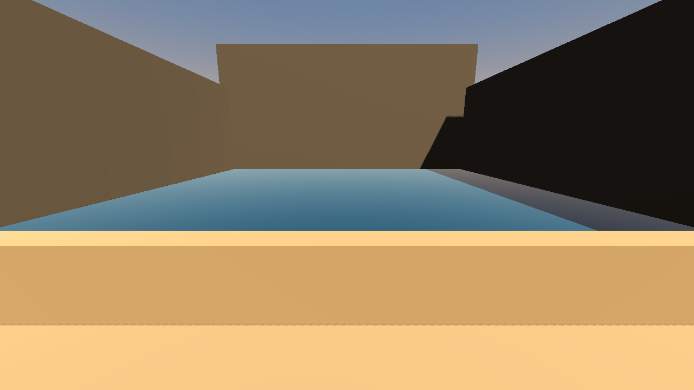

# low_tide

Phase 0 stamp. Architect, 2026-08-20.

## Scope

One cove only. Walk, wait, water falls, a path appears, a note that is nonsense until you have seen the path.

If that hour is fun in Discord with 2–4 friends, the archipelago grows later. Not now.

Knowledge is the only progression: shared camp journal and one planted secret.

The map can be wrong on purpose.

Out of scope: combat, quest markers, lore dump, MMO, Outer Wilds at full scope, Spine.

## Ownership

- **Place:** the bay — terrain, light, sound of the one walkable cove.
- **Clock:** tide (when water falls / what appears when), radios, shared camp journal.
- **Skipper:** merge cut, one path to main. Author never merges. Joe (joemosby) is off the review path. Architect stamps claims.

## Owner claims

Recorded as claimed, not as extra scope.

- **Place:** the path is already in the mesh; water covers it until Clock drops the tide. Place does not spawn geometry or paint a glow. The map can lie.
- **Clock:** drops the tide; does not spawn or mark the path. One camp-journal note that is nonsense until you have walked that path. Radios stay quiet in Phase 0.

## License

Code is MIT. See [LICENSE](LICENSE).
